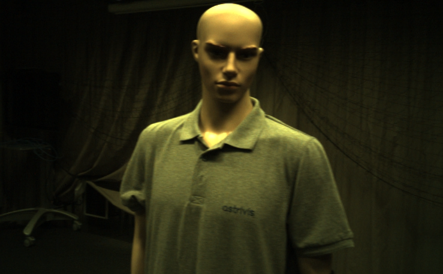
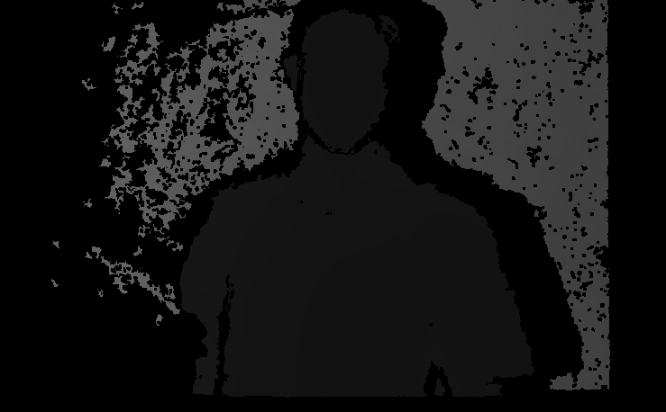
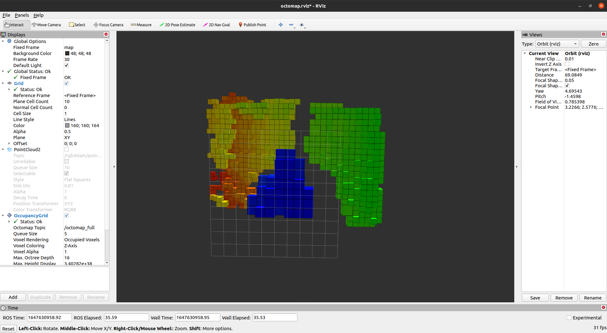

This project developed an algorithm for RGB-D cameras to locate the camera itself and to map the environment using octomap. It is tested on Ubuntu 20 and ROS noetic.

The dataset used in this repo is from ETH3D, which can be found at:
https://www.eth3d.net/slam_datasets

An input image pair is shown below,

and an output octomap is shown as:

